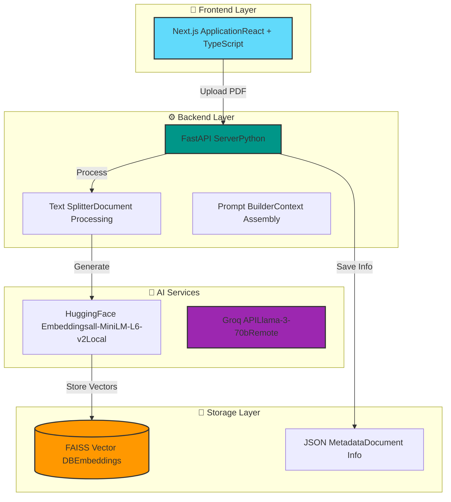

# 📚 RAG Q&A Chatbot 

A full-stack Retrieval-Augmented Generation (RAG) application capable of answering questions based on uploaded PDF documents. Built with **Next.js**, **FastAPI**, **LangChain**, and **Docker**.

## 🚀 Features

- **📂 Document Ingestion**: Upload multiple PDF files via the UI.
- **🧠 Advanced RAG Pipeline**:
  - Text Chunking & Splitting (RecursiveCharacterTextSplitter).
  - Local Embeddings (HuggingFace `all-MiniLM-L6-v2`).
  - Vector Storage (FAISS).
- **🤖 LLM Integration**: Powered by **Llama-3-70b** via Groq API for lightning-fast inference.
- **💬 Modern UI**: Chat interface with markdown support, history management, and **citation sources**.
- **🔒 Secure**: API keys managed via environment variables (not exposed in code).
- **🐳 Dockerized**: Fully containerized environment managed by a custom `docker.sh` script.

## 🛠️ Architecture


### System Architecture




## 📦 Prerequisites

Before you begin, ensure you have the following installed on your machine:

* **Docker** & **Docker Compose** - [Install Docker](https://docs.docker.com/get-docker/)
* **Git** - [Install Git](https://git-scm.com/downloads)

## ⚡ Quick Start Guide

Follow these steps to run the application locally.

### 1. Clone the Repository

```bash
git clone https://github.com/oumniya03/Projet-rag.git
cd Projet-rag
```

### 2. Configure Environment Variables

For security reasons, API keys are not stored in the repository. You must create a `.env` file at the root of the project.

Create a file named `.env` and add your Groq API Key:

```env
GROQ_API_KEY=gsk_your_groq_api_key_here
```

> **Note:** You can obtain a Groq API key from [https://console.groq.com](https://console.groq.com)

### 3. Run with Docker Script

The project includes a helper script `docker.sh` as requested in the challenge requirements.

**Start the application:**

```bash
chmod +x docker.sh  # Only needed the first time (Linux/Mac/GitBash)
./docker.sh up
```

> **Note:** The first launch may take a few minutes to build the images and download the embedding model.

### 4. Access the Application

Once the containers are running, you can access:

* **Frontend (Chat UI):** [http://localhost:3000](http://localhost:3000)
* **Backend (API Docs):** [http://localhost:8000/docs](http://localhost:8000/docs)

## 🔧 Management Commands (docker.sh)

| Command | Description |
|---------|-------------|
| `./docker.sh up` | Builds and starts the containers in the background |
| `./docker.sh down` | Stops and removes containers and networks |
| `./docker.sh build` | Rebuilds the images (useful after code changes) |
| `./docker.sh logs` | Displays real-time logs from backend and frontend |

## 🧪 Evaluation & Testing

### API Endpoint (`/ask`)

Per the challenge requirements, a compliant endpoint is available:

```bash
curl -X POST "http://localhost:8000/ask" \
     -H "Content-Type: application/json" \
     -d '{"question": "What is Cloud Computing?"}'
```

**Expected Response Format:**

```json
{
  "answer": "Cloud Computing is...",
  "sources": ["document1.pdf", "document2.pdf"]
}
```

### Self-Evaluation Script (LLM-as-a-Judge)

An automated evaluation script is included to test **Faithfulness** and **Answer Relevance** using Llama-3 as a judge.

**Run the evaluation:**

```bash
# Requires local python environment
pip install python-dotenv langchain-groq langchain
python evaluate.py
```

The script will:
- Test multiple sample questions
- Evaluate answer quality using LLM-based metrics
- Generate a report with scores for faithfulness and relevance

## 📂 Project Structure

```
Projet-rag/
├── backend/
│   ├── main.py              # FastAPI Application & RAG Logic
│   ├── Dockerfile           # Backend Container Configuration
│   └── requirements.txt     # Python Dependencies
├── frontend/
│   ├── app/
│   │   └── page.tsx         # Main Chat Interface (React/Next.js)
│   ├── Dockerfile           # Frontend Container Configuration
│   └── tailwind.config.ts   # Styling Configuration
├── data/                    # Persisted Data (Indices & Uploads)
├── docker-compose.yml       # Docker Orchestration
├── docker.sh                # Management Script
├── evaluate.py              # Quality Assessment Script
├── .env                     # Environment Variables (create this)
└── README.md                # This file
```

## 🛠️ Technology Stack

### Backend
- **FastAPI** - Modern, fast web framework for building APIs
- **LangChain** - Framework for developing LLM applications
- **Groq** - Ultra-fast LLM inference
- **Sentence Transformers** - State-of-the-art text embeddings
- **FAISS** - Efficient similarity search and clustering

### Frontend
- **Next.js 14** - React framework with App Router
- **TypeScript** - Type-safe JavaScript
- **Tailwind CSS** - Utility-first CSS framework
- **React Hooks** - Modern state management

### Infrastructure
- **Docker** - Containerization
- **Docker Compose** - Multi-container orchestration

## 🚀 Features

- ✅ **Document Upload & Processing** - Support for PDF, TXT, and other text formats
- ✅ **Intelligent Retrieval** - Semantic search using embeddings
- ✅ **Contextual Answers** - RAG-powered responses with source attribution
- ✅ **Real-time Chat Interface** - Modern, responsive UI
- ✅ **API Documentation** - Auto-generated with FastAPI/Swagger
- ✅ **Automated Evaluation** - LLM-as-a-Judge quality metrics
- ✅ **Docker Deployment** - One-command setup and teardown

## 📝 Usage Guide

### Uploading Documents

1. Navigate to [http://localhost:3000](http://localhost:3000)
2. Use the upload interface to add your documents
3. Wait for the processing confirmation

### Asking Questions

1. Type your question in the chat interface
2. Press Enter or click Send
3. View the AI-generated answer with source references

### API Integration

You can integrate the backend API into your own applications:

```python
import requests

response = requests.post(
    "http://localhost:8000/ask",
    json={"question": "Your question here"}
)

answer = response.json()["answer"]
sources = response.json()["sources"]
```

## 🔍 Troubleshooting

### Port Already in Use

If ports 3000 or 8000 are already in use:

```bash
# Modify docker-compose.yml to use different ports
# Change "3000:3000" to "3001:3000" for frontend
# Change "8000:8000" to "8001:8000" for backend
```

### Container Build Failures

```bash
./docker.sh down
docker system prune -a
./docker.sh build
./docker.sh up
```

### Missing Environment Variables

Ensure your `.env` file exists and contains:
```env
GROQ_API_KEY=your_actual_key_here
```

## 🤝 Contributing

This is a challenge submission project. For questions or feedback, please contact the author.


## 👤 Author

**Oumniya**

- GitHub: [@oumniya03](https://github.com/oumniya03)
- Project: [Projet-rag](https://github.com/oumniya03/Projet-rag)

## 🎯 Challenge Requirements Met

- ✅ Dockerized application with `docker.sh` script
- ✅ RAG implementation with document retrieval
- ✅ `/ask` endpoint with proper response format
- ✅ Evaluation script for quality assessment
- ✅ Modern, responsive frontend interface
- ✅ Complete documentation

---


*Built with ❤️ using FastAPI, Next.js, and Docker*
